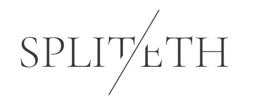

    </img>
    

        
        <a href ="https://www.linkedin.com/in/shobhit-singh-632045195/"></img></a>
        
        <a href ="https://shobhitsingh.vercel.app/"></img></a>
    

### SPLIT\ETH

- splitETH is a <ins>decentralised ether splitting application</ins>.
- In splitETH one can <ins>create countless split groups</ins> with amount to be split among other individuals.
- It's simple UI lets anyone use it without any complexity.
- It gives <ins>users privacy</ins> as only splits related to them (owner or member) are displayed to them which makes splitETH completely <ins>personalised</ins>.
- One can easily pay the split with their connected wallet and account.
- splitETH gives a <ins>complete set of analysis</ins> on a group like:-
    - amount yet to be paid is shown to the owner of split 
    - number of members of split who paid.

### STEPS TO USE

- clone the git repository
`git clone https://github.com/Shobhitsingh-2503/SPLIT-ETH.git`
- run `npm start` on the terminal
- The Dapp will run on the default `localhost:3000` server
- connect to the wallet (ex- Metamask).
- and you are ready to go. 

<h4>This whole project is subjected to &#169; copyright to Shobhit Singh</h4>
